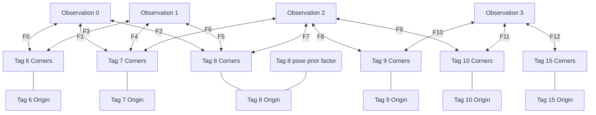

# SFM Mapper

## Resources

- Factor Graphs and GTSAM. https://gtsam.org/tutorials/intro.html#magicparlabel-65377
- Factor Graphs for Robot Perception. Dellaert & Kaess. https://www.cs.cmu.edu/~kaess/pub/Dellaert17fnt.pdf
- An Introduction to Factor Graphs. Loeliger. https://people.binf.ku.dk/~thamelry/MLSB08/hal.pdf (a good slide deck)

The TLDR of the TLDR (really. Go skim at least [Factor Graphs and GTSAM](https://gtsam.org/tutorials/intro.html#magicparlabel-65411)) is that a factor graph is a graph of variables (things we want to optimize, like robot poses or landmark pose) connected by "factors" which describe relationships between our variables. For example, this factor graph shows 3 robot state variables (x1, x2, and x3; the white circles). The relationship between these states is described by factors (black filled in circles) which encode information about robot pose delta between states (in the backbone), and an external measurement from a sensor like GPS.


The primary difference between this and tradidional nonlinear least squares is that we don't have to explicitly build a cost function. Instead, we're interested in finding the maximum likelihood solution, given a factor graph and *noise models* (see Dellaert Ch. 2.2), which describe how sure we are about measurements.

Terminology
- Key: A unique identifier for a state, such as X0, L0, etc. Really a size_t in a typedef.
- Expression: an autodiff expression. Can be constant or constructed using a Key

## Problem Formulation

We build up a factor graph of landmarks (tags), and estimated camera poses in the world. Our decision variables are:
- Poses of tags in the world (located sufficiently near an initial guess that things don't diverge)
  - This is the pose of the tag origin. The 4 tag corners are offset from this tag origin by +- 3 inches in x and z.
- Poses from where camera observations were recorded from

Our factors:
- From camera observation pose -> each tag corner we can see (in pixels). Noise model is is tag corner location in pixels. The tag corner is a GTSAM "expression" that is (tag origin + (tag origin -> corner N)) for each corner.
- A "pose prior factor" on up to N many tags describing how sure we are in its pose in SE(3). In this example, we measured tag 8's location with a tape measure, but didn't measure any other ones. We could add prior factors to as many tags as we want - GTSAM will maximize the overall solution likelihood given this information.




In code this ends up boiling down to something like this for tag observations:

```cpp
// Get a list of Expressions for each corner's location in the field given an
// Expression for the tag origin pose in the field
vector<Point3_> WorldToCornersFactor(Pose3_ worldTtag) {
  vector<Point3_> out;
  for (const auto &p : tagToCorners) {
    out.push_back(gtsam::transformFrom(worldTtag, p));
  }

  return out;
}

// later

Isotropic::shared_ptr cameraNoise{
    Isotropic::Sigma(2, 1.0)}; // one pixel in u and v

// Add all our tag observation factors
for (const auto &[stateKey, tags] : keyframes) {
  for (const TagDetection &tag : tags) {
    // Where our tag's corners are in the field
    auto worldPcorners = TagModel::WorldToCornersFactor(L(tag.id));

    // add all of the tag's corners
    constexpr int NUM_CORNERS = 4;
    for (size_t i = 0; i < NUM_CORNERS; i++) {
      // Decision variable - where our camera is in the world
      const Pose3_ worldTbody_fac(stateKey);

      // Where we'd predict the i'th corner of the tag to be,
      // given camera located at (worldTbody_fac * robotTcamera) observing worldPcorners[i]
      const auto prediction = PredictLandmarkImageLocationFactor(
          worldTbody_fac, robotTcamera, cameraCal, worldPcorners[i]);

      // where we saw the i'th corner in the image
      Point2 measurement = {tag.corners[i].x, tag.corners[i].y};

      // Add this prediction/measurement pair to our graph
      graph.addExpressionFactor(prediction, measurement, cameraNoise);
    }
  }
}
```

And... that's about it! We just need to provide a sane initial guess for the solver (I used solvepnp for camera poses, and the starting tag map for tag poses), as well as add prior factors to at least one tag to anchor our map, and throw this at Dogleg or L-M or another traditional nonlinear optimization algorithm. GTSAM will take care of converting our factor graph into a Bayes net (Dellaert, ch 1.3) and then maximizing the product of all factor graph potentials.
