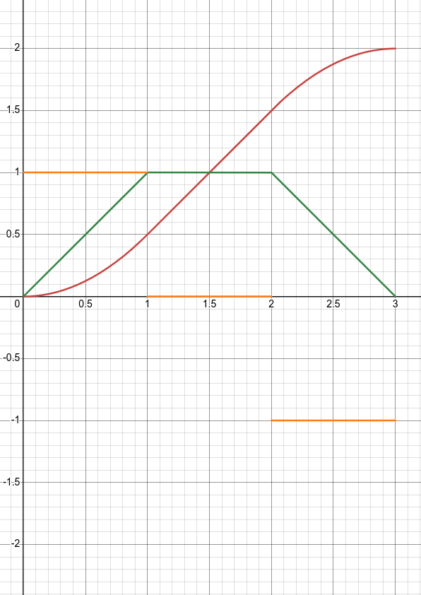
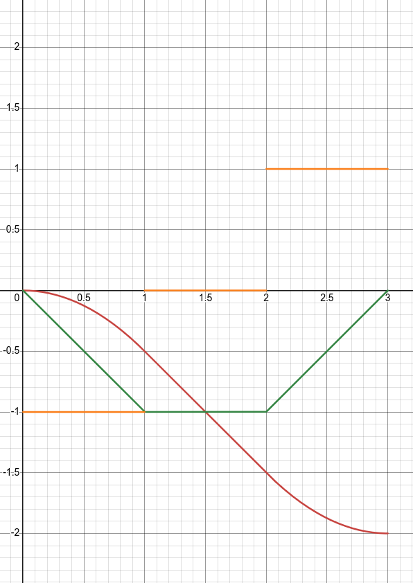
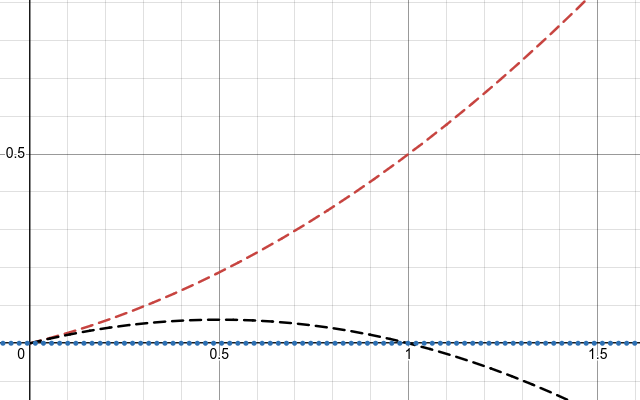

# Trapezoid Profile

## [Interactive Desmos Graph](https://www.desmos.com/calculator/hcj8m3jycn)

### Overview

The fastest possible profile for the double integrator is one that applies the maximum allowed input in one direction and then the maximum allowed input in the other, also known as bang-bang. If there is an active maximum velocity constraint, this becomes bang-zero-bang. Notice that the plot of velocity versus time for this case resembles a trapezoid, thus the name.

We will utilize the subscript m to denote the maximum allowed acceleration magnitude (`a_m`) and velocity magnitude (`v_m`). To refer to the most extreme velocity achieved by the profile we will use the term peak velocity (`v_p`). Occuring when the acceleration of a profile switches sign, it will be either greater than or equal to, or less than or equal to both the initial and target velocity depending on the profile sign (more on this later).

First, let us derive the dynamics of the system. Our control input is acceleration, which as discussed earlier, will take the form of a piecewise constant over the time of the profile. Integrating constant acceleration with respect to time yields equation (1).
```
v = v_i + at   (1)
```
Integrating this once again gives equation (2).
```
x = x_i + v_i t + at²/2   (2)
```
We can solve (1) for `t` to get `t = (v - v_i)/a`. Substituting this into (2) and cleaning up the result yields equation (3).
```
x = x_i + v_i((v - v_i)/a) + a((v - v_i) / a)²/2
x = x_i + (v_i v - v_i²)/a + (v² - 2vv_i + v_i²)/(2a)
x = x_i + (v² + v_i²)/(2a) + (-v_i²)/a + vv_i/a - vv_i/a
x = x_i + (v² - v_i²)/(2a)
x - x_i = (v² - v_i²)/(2a)
(x - x_i)(2a) = v² - v_i²
2aΔx = v_t² - v_i²                                          (3)
```
This is the primary equation of motion we will use in this derivation. The subscripts of t and i denote target and initial respectively, and `Δx` denotes the displacement from an initial state to a target state.

### Determining the sign of the profile.

The sign of the profile can be defined as the sign of the acceleration of the first segment of the profile. If we separate the profile into segments based on the value of the input, the input applied for the first, second, and third sections can be found by mulitplying `a_m` by `s`, `0`, and `-s` respectively. From this, we can see that for profiles with a positive sign, the peak velocity would be greater than or equal to both the initial and the target velocity, and for profiles with a negative sign, the peak velocity would be less than or equal to the initial and target velocities.
 

The optimal sign of the profile can be determined by looking at the distance covered by the shortest profile that can connect the initial and target velocity while respecting the acceleration constraint. This minimum profile takes the form of a straight line in the velocity versus time plot with an acceleration equal to `sign(v_t - v_i)a_m`. The sign of the optimal profile for all displacements greater than that of the minimum profile would be positive, and the sign of optimal profile for all displacements less than that of the minimum profile would be negative. This threshold distance (`d`) is derived below.
```
2sign(v_t - v_i)a_m d = v_t² - v_i²
2sign(v_t - v_i)a_m d = (v_t - v_i)(v_t + v_i)
2sign(v_t - v_i)a_m d = sign(v_t - v_i)|v_t - v_i|(v_t + v_i)
2a_m d = |v_t - v_i|(v_t + v_i)
d = |v_t - v_i|(v_t + v_i)/(2a_m)                               (4)
```



Okay now fix the rest of it.
Recall that occasionally there can be both a profile with a positive sign and a profile with a negative sign that successfully transition between the initial and target states. To understand this, imagine a profile where the initial and target velocities are above zero. A profile that has a negative sign and a time just a little bit over the minimum valid time will still end up with a positive displacement. Now consider if the profile had a positive sign. The same displacement would be possible to cover faster because the average velocity would be higher. Note that for the formulation discussed here, ambiguity only arises when both the initial and target velocities have the same signs.

While comparing with the threshold distance will handle the majority of these cases, solely relying on it cannot handle the case where the initial and target states make the minimum profile. While it is not common for two random states to give rise to this, it is relatively common when profiles are being generated from a reference on the final segment of a profile. If floating point error causes the state to be slightly above or below the threshold distance, the sign is properly determined and the next reference is guaranteed to be correct (within floating point tolerances); however, in the case it is equal and the wrong sign is chosen, a reference for a new, longer profile may be generated. This can lead to choatic input sign changes and prevent the profile from coming to rest. This can be avoided by preferring the negative sign when both state velocities are below zero, and a positive sign otherwise. Because the scenario with different initial signs has one valid profile, meaning either sign will lead to valid solutions within floating point tolerance, this preference can be simplified to only check the sign of the target velocity.

### Determining the peak velocity

In order to find the peak velocity (`v_p`), let us first define `a = sa_m` and that the profile displacement (`Δx`) be separated into segments based on the value of the input. Let the subscripts 1, 2, and 3, indicate the first section, the optional second section, and the third section respectively.
```
Δx = x_1 + x_2 + x_3   (5)
```
To determine the if the profile has an active velocity constraint, we must first calculate the peak velocity as if it didn't. To start, we substitute in `x_2 = 0`.
```
Δx = x_1 + x_3   (6)
```
where
```
2ax_1 = v_p² - v_i²
x_1 = (v_p² - v_i²)/(2a)
```
and
```
-2ax_3 = v_t² - v_p²
2ax_3 = v_p² - v_t²
x_3 = (v_p² - v_t²)/(2a)
```
Substituting these into (6) yields
```
(v_p² - v_i²)/(2a) + (v_p² - v_t²)/(2a) = Δx
(2v_p² - (v_t² + v_i²))/(2a) = Δx
2v_p² - (v_t² + v_i²) = 2aΔx
2v_p² = 2aΔx + v_t² + v_i²
v_p² = aΔx + (v_t² + v_i²)/2
v_p = √(aΔx + (v_t² + v_i²)/2)                 (7)
```
For the case where v_p exceeds the the velocity limit, letting `v_l = s v_m` means the values of `x_1` and `x_3` can be found by substituting `v_p = v_l`
```
x_1 = (v_l² - v_i²) / (2 a)   (8)
x_3 = (v_l² - v_t²) / (2 a)   (9)
```
which can be used to find x_2 by rearranging (5) to get
```
x_1 + x_2 + x_3 = Δx
x_2 = Δx - x_1 - x_3   (10)
```
